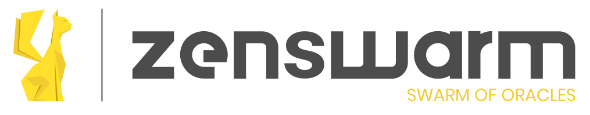

<h1 align="center">
Zenswarm Dashboard
  </br>
  <sub>Zenroom based Swarm of Oracles monitoring</sub>
</h1>

<p align="center">
  <a href="https://dyne.org">
    
  </a>
</p>

<br><br>

<h4 align="center">
  <a href="#-install">💾 Install</a>
  <span> • </span>
  <a href="#-quick-start">🎮 Quick start</a>
  <span> • </span>
  <a href="#-configuration">🔧 Configuration</a>
  <span> • </span>
  <a href="#-testing">📋 Testing</a>
  <span> • </span>
  <a href="#-troubleshooting--debugging">🐛 Troubleshooting & debugging</a>
  <span> • </span>
  <a href="#-acknowledgements">😍 Acknowledgements</a>
  <span> • </span>
  <a href="#-links">🌐 Links</a>
  <span> • </span>
  <a href="#-contributing">👤 Contributing</a>
  <span> • </span>
  <a href="#-license">💼 License</a>
</h4>


Zenswarm Dashboard is a simple interface to monitor the <a href="https://github.com/dyne/zenswarm">Zenroom based Swarm of Oracles</a>. You can check swarm 
of oracles status. 
* Swarm of Oracles status check:Get all nodes and check if they are running. See details like logs, 
region,version in which blockchain the node notarizes, in which blockchain the node is subscribed, 
a link to an Api test's interface
* L0: listen to the blocks generated on a specific layer 0
* Software Passport: find licenses in a repository
* Services: monitor active services
* Oracles Consensus Post: Post consensus to the Oracles
* Verify Notarization: Provide the transaction hash to verify the transaction notarization 


<details id="toc">
 <summary><strong>🚩 Table of Contents</strong> (click to expand)</summary>

* [Install](#-install)
* [Quick start](#-quick-start)
* [Links](#-links)
* [Contributing](#-contributing)
* [License](#-license)
</details>

***
## 💾 Install
```
pnpm install
pnpm run build
pnpm run start
```


***
## 🎮 Quick start

```pnpm run dev```


***

**[🔝 back to top](#toc)**

***
## 😍 Acknowledgements

[](http://www.dyne.org)

Copyleft (ɔ) 2021 by [Dyne.org](https://www.dyne.org) foundation, Amsterdam

Designed, written and maintained by Puria Nafisi Azizi.

Special thanks to Mr. W. White for his special contributions.

**[🔝 back to top](#toc)**

***
## 🌐 Links

https://github.com/dyne/zenswarm
https://dyne.org/

**[🔝 back to top](#toc)**

***
## 👤 Contributing

Please first take a look at the [Dyne.org - Contributor License Agreement](CONTRIBUTING.md) then

1.  🔀 [FORK IT](../../fork)
2.  Create your feature branch `git checkout -b feature/branch`
3.  Commit your changes `git commit -am 'Add some fooBar'`
4.  Push to the branch `git push origin feature/branch`
5.  Create a new Pull Request
6.  🙏 Thank you


**[🔝 back to top](#toc)**

***
## 💼 License
    Zenswarm Dashboard - {tagline}
    Copyleft (ɔ) 2021 Dyne.org foundation, Amsterdam

    This program is free software: you can redistribute it and/or modify
    it under the terms of the GNU Affero General Public License as
    published by the Free Software Foundation, either version 3 of the
    License, or (at your option) any later version.

    This program is distributed in the hope that it will be useful,
    but WITHOUT ANY WARRANTY; without even the implied warranty of
    MERCHANTABILITY or FITNESS FOR A PARTICULAR PURPOSE.  See the
    GNU Affero General Public License for more details.

    You should have received a copy of the GNU Affero General Public License
    along with this program.  If not, see <http://www.gnu.org/licenses/>.

**[🔝 back to top](#toc)**
